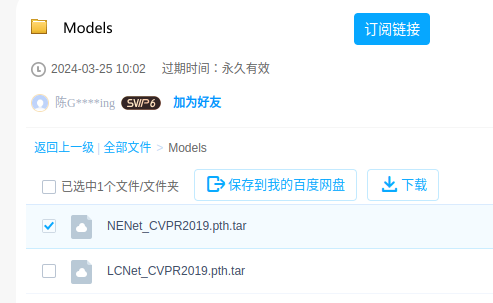
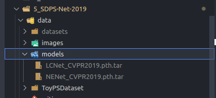
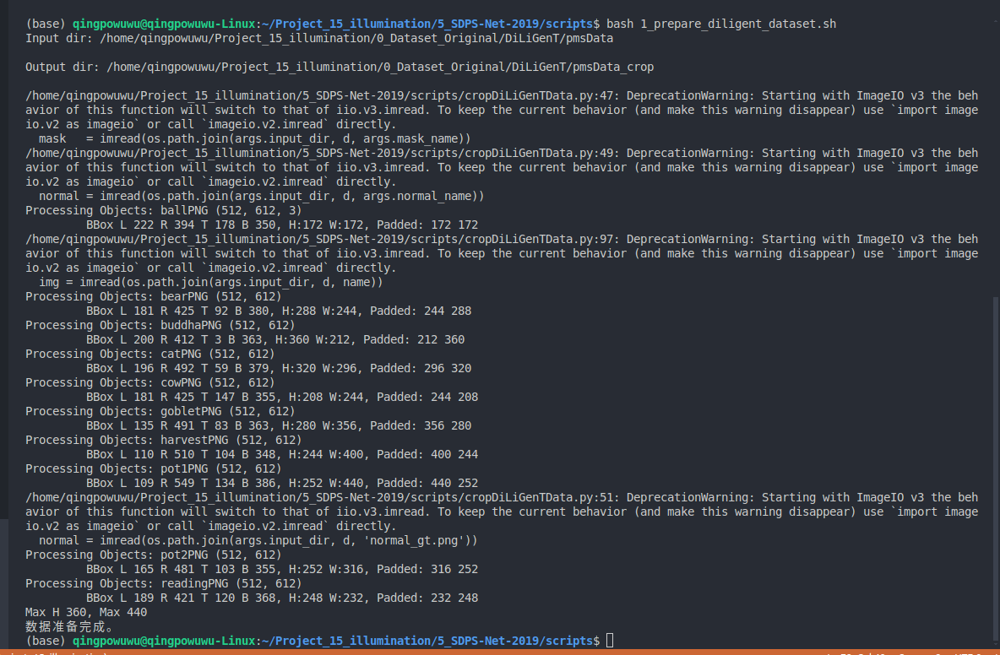
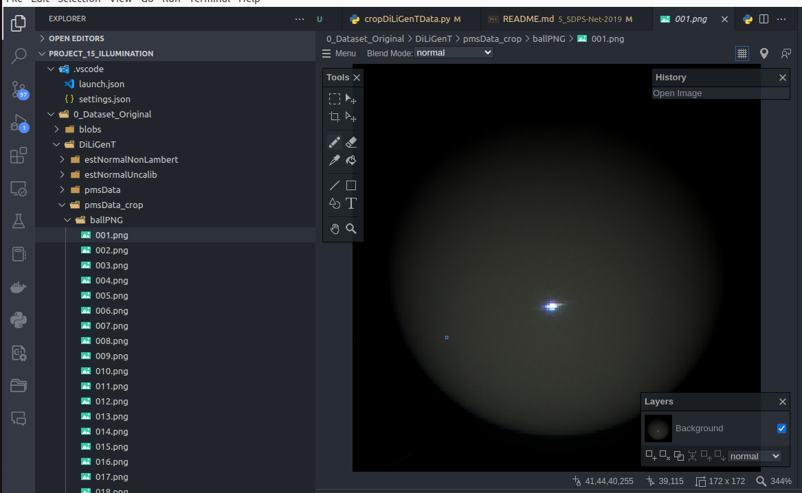
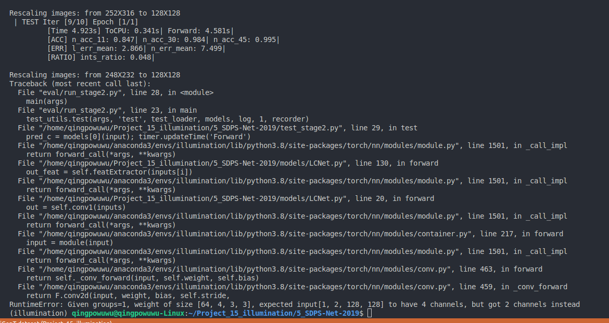

# SDPS-Net
**[SDPS-Net: Self-calibrating Deep Photometric Stereo Networks, CVPR 2019 (Oral)](http://guanyingc.github.io/SDPS-Net/)**.
<br>
[Guanying Chen](https://guanyingc.github.io), [Kai Han](http://www.hankai.org/), [Boxin Shi](http://alumni.media.mit.edu/~shiboxin/), [Yasuyuki Matsushita](http://www-infobiz.ist.osaka-u.ac.jp/en/member/matsushita/), [Kwan-Yee K. Wong](http://i.cs.hku.hk/~kykwong/)
<br>

This paper addresses the problem of learning based _uncalibrated_ photometric stereo for non-Lambertian surface.
<br>
<p align="center">
    
    
</p>

### _Changelog_
- July 28, 2019: We have already updated the code to support Python 3.7 + PyTorch 1.10. To run the previous version (Python 2.7 + PyTorch 0.40), please checkout to `python2.7` branch first (by `git checkout python2.7`).

## Dependencies
SDPS-Net is implemented in [PyTorch](https://pytorch.org/) and tested with Ubuntu (14.04 and 16.04), please install PyTorch first following the official instruction. 

- Python 3.7 
- PyTorch (version = 1.10)
- torchvision
- CUDA-9.0 # Skip this if you only have CPUs in your computer
- numpy
- scipy
- scikit-image 

You are highly recommended to use Anaconda and create a new environment to run this code.
```shell
# Create a new python3.7 environment named py3.7
conda create -n py3.7 python=3.7

# Activate the created environment
source activate py3.7

# Example commands for installing the dependencies 
conda install pytorch torchvision cudatoolkit=9.0 -c pytorch
conda install -c anaconda scipy 
conda install -c anaconda scikit-image 

# Download this code
git clone https://github.com/guanyingc/SDPS-Net.git
cd SDPS-Net
```
## Overview
We provide:
- Trained models
    - LCNet for lighting calibration from input images
    - NENet for normal estimation from input images and estimated lightings.
- Code to test on DiLiGenT main dataset
- Full code to train a new model, including codes for debugging, visualization and logging.

## Testing
### Download the trained models

直接从百度云 ([LCNet and NENet](https://pan.baidu.com/s/10huOyPkfDSkDUK23_j4y1w?pwd=i5ha)) 上面下载 2个 trained models: 



然后 put them in `./data/models/`.



### Test SDPS-Net on the DiLiGenT main dataset
#### (1) Crop DiLiGenT 数据集 中的 pmsData 文件夹中的 2d-images

运行 下面的 command (我把原 repo 中 `prepare_diligent_dataset.sh`的 具体代码 修改了一下，因为我已经下载了 DiLiGenT 数据集 在 `/home/qingpowuwu/Project_15_illumination/0_Dataset_Original/DiLiGenT`) 来 crop DiLiGenT/pmsData 中的2d-images。


把 /home/qingpowuwu/Project_15_illumination/0_Dataset_Original/DiLiGenT/pmsData/filenames.txt 重新命名成 /home/qingpowuwu/Project_15_illumination/0_Dataset_Original/DiLiGenT/pmsData/names.txt

然后运行下面的脚本：

```shell
# Prepare the DiLiGenT main dataset
sh scripts/1_prepare_diligent_dataset.sh
# This command will centered crop DiLiGenT/pmsData 中的 2d-images，并且保存到 DiLiGenT/pmsData_crop 文件夹里面
# the original images based on the object mask with a margin size of 15 pixels.
```
得到：


打开看看，发现 图片确实被 crop 了:



#### (2) Testing Trained Models 

```shell
# Test SDPS-Net on DiLiGenT main dataset using all of the 96 image
CUDA_VISIBLE_DEVICES=0 python eval/run_stage2.py --retrain data/models/LCNet_CVPR2019.pth.tar --retrain_s2 data/models/NENet_CVPR2019.pth.tar
# Please check the outputs in data/models/

# If you only have CPUs, please add the argument "--cuda" to disable the usage of GPU
python eval/run_stage2.py --cuda --retrain data/models/LCNet_CVPR2019.pth.tar --retrain_s2 data/models/NENet_CVPR2019.pth.tar
```



这个 bugs 和 `4_PS-FCN-master-2018` 的代码中也会遇到，不知道是不是因为这篇工作在测试的时候，只有 10个 2d-images, 所以 test 了10个 2d-images 之后就会报错

### Test SDPS-Net on your own dataset
You have two options to test our method on your dataset. In the first option, you have to implement a customized Dataset class to load your data, which should not be difficult. Please refer to `datasets/UPS_DiLiGenT_main.py` for an example that loads the DiLiGenT main dataset.

If you don't want to implement your own Dataset class, you may try our `datasets/UPS_Custom_Dataset.py`. However, you have to first arrange your dataset in the same format as the `data/ToyPSDataset/`. Then you can call the following commands.
```shell
CUDA_VISIBLE_DEVICES=0 python eval/run_stage2.py --retrain data/models/LCNet_CVPR2019.pth.tar --retrain_s2 data/models/NENet_CVPR2019.pth.tar --benchmark UPS_Custom_Dataset --bm_dir /path/to/your/dataset

# To test SDPS-Net on the ToyPSDataset, simply run
CUDA_VISIBLE_DEVICES=0 python eval/run_stage2.py --retrain data/models/LCNet_CVPR2019.pth.tar --retrain_s2 data/models/NENet_CVPR2019.pth.tar --benchmark UPS_Custom_Dataset --bm_dir data/ToyPSDataset/
# Please check the outputs in data/models/
```
You may find input arguments in `run_model_opts.py` (particularly `--have_l_dirs`, `--have_l_ints`, and `--have_gt_n`) useful when testing your own dataset.

## Training
We adopted the publicly available synthetic [PS Blobby and Sculpture datasets](https://github.com/guanyingc/PS-FCN) for training.
To train a new SDPS-Net model, please follow the following steps:

### Download the training data
```shell
# The total size of the zipped synthetic datasets is 4.7+19=23.7 GB 
# and it takes some times to download and unzip the datasets.
sh scripts/download_synthetic_datasets.sh
```
If the above command is not working, please manually download the training datasets from BaiduYun ([PS Sculpture Dataset and PS Blobby Dataset](https://pan.baidu.com/s/1WUVu9ibIBh4wM1shTXBuNw?pwd=snyc) and put them in `./data/datasets/`.

### First stage: train Lighting Calibration Network (LCNet)
```shell
# Train LCNet on synthetic datasets using 32 input images
CUDA_VISIBLE_DEVICES=0 python main_stage1.py --in_img_num 32
# Please refer to options/base_opt.py and options/stage1_opt.py for more options

# You can find checkpoints and results in data/logdir/
# It takes about 20 hours to train LCNet on a single Titan X Pascal GPU.
```
### Second stage: train Normal Estimation Network (NENet)
```shell
# Train NENet on synthetic datasets using 32 input images
CUDA_VISIBLE_DEVICES=0 python main_stage2.py --in_img_num 32 --retrain data/logdir/path/to/checkpointDirOfLCNet/checkpoint20.pth.tar
# Please refer to options/base_opt.py and options/stage2_opt.py for more options

# You can find checkpoints and results in data/logdir/
# It takes about 26 hours to train NENet on a single Titan X Pascal GPU.
```

## FAQ

#### Q1: How to test SDPS-Net on other datasets?
- You can implement a customized Dataset class to load your data. You may also use the provided `datasets/UPS_Custom_Dataset.py` Dataset class to load your data. However, you have to first arrange your dataset in the same format as the `data/ToyPSDataset/`. Precomputed results on DiLiGenT main dataset, Gourd\&Apple dataset, Light Stage Dataset and Synthetic Test dataset are available upon request.

#### Q2: What should I do if I have problem in running your code?
- Please create an issue if you encounter errors when trying to run the code. Please also feel free to submit a bug report.

#### Q3: Could I run your code only using CPUs?
- The good news is that you can simply append `--cuda` in your command to disable the usage of GPU. The running time for the testing on DiLiGenT benchmark using CPUs is still bearable (should be less than 20 minutes). However, it is EXTREMELY SLOW for training! 

## Citation
If you find this code or the provided models useful in your research, please consider cite: 
```
@inproceedings{chen2019SDPS_Net,
  title={SDPS-Net: Self-calibrating Deep Photometric Stereo Networks},
  author={Chen, Guanying and Han, Kai and Shi, Boxin and Matsushita, Yasuyuki and Wong, Kwan-Yee~K.},
  booktitle={CVPR},
  year={2019}
}
```
